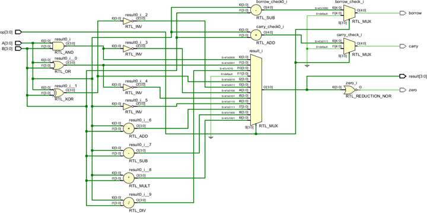
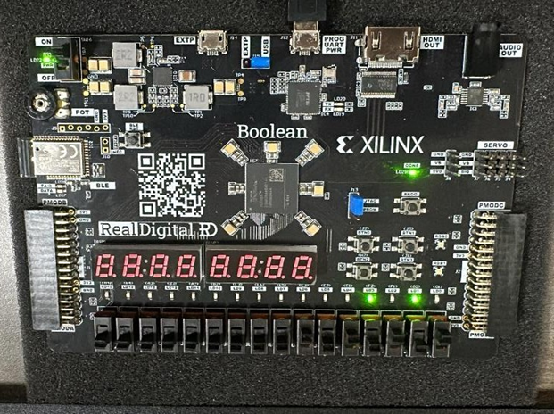

# 🔢 4-Bit ALU (Arithmetic Logic Unit) – Verilog HDL

This project is a 4-bit ALU designed using **Verilog HDL**, capable of performing basic arithmetic and logic operations. It was implemented and tested on an **FPGA board** as part of a mini-project.

## 🎯 Features

- 4-bit inputs: `A` and `B`
- Control input: `ALU_Sel` (operation selector)
- Supported operations:
  - Addition
  - Subtraction
  - Multiplication
  - Division (with divide-by-zero detection)
  - Bitwise AND, OR, XOR
  - Comparison (A > B)
- Output:
  - 4-bit `Result`
  - Status Flags: `Zero`, `Carry`, `Overflow`, `DivisionByZero`

---

## 📸 Circuit Diagram

## ✅ Working Output

---

## 🔍 Key Test Cases Verified

| A (bin) | B (bin) | ALU_Sel | Operation   | Expected Output | Flags Triggered                |
|---------|---------|---------|-------------|------------------|--------------------------------|
| 0110    | 0011    | 0000    | A + B       | 1001 (9)         | Carry = 0, Zero = 0            |
| 0110    | 0110    | 0001    | A - B       | 0000 (0)         | Zero = 1                       |
| 1111    | 0001    | 0010    | A × B       | 1111 (15)        | Overflow = 0                   |
| 0110    | 0000    | 0011    | A / B       | ----             | DivisionByZero = 1             |
| 0101    | 0011    | 1110    | A > B?      | 0001 (True)      | -                              |

---

## 📁 Project Structure

4-bit-ALU/
├── src/
│ ├── alu.v # Main Verilog module
│ └── alu_tb.v # Testbench for simulation (optional)
├── images/
│ ├── Circuit_Diagram.png
│ └── output_photo.png
├── docs/
│ └── project_report.pdf
├── README.md
└── .gitignore

---

## 🛠️ Tools Used

- Verilog HDL
- Xilinx ISE / ModelSim (for simulation and synthesis)
- FPGA board (specify model if available)

---

## 👨‍💻 Author

**Aaryan Nitin Purav**  
B.Tech in Electronics & Telecommunication Engineering  
Vidyalankar Institute of Technology, Mumbai

---

## 📜 License

This project is for academic and learning purposes. Feel free to fork and contribute.
